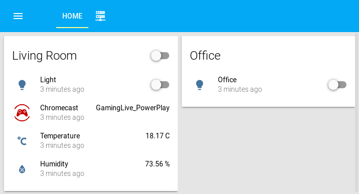

#hass-config

My [Home Assistant](https://home-assistant.io) configuration used at home.

 

# How to test

You can test the configuration of [Home Assistant](https://www.home-assistant.io/docs/installation/virtualenv/) in a virtualenv :

```
 mkvirtualenv --python=/usr/bin/python3 hass-config
 pip3.4 install homeassistant
 hass -c home-assistant/
```
